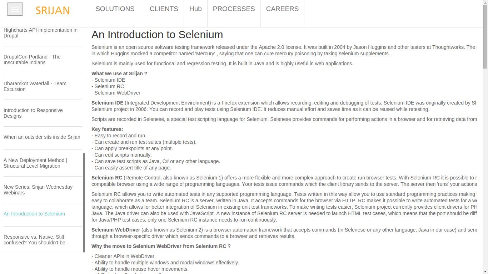

# Sarus <small>Beta</small>

### Check out the [Live Demo](http://www.theweeklybyte.com)

Sarus is a minimalistic front-end framework that lets media sites and blogs create an SEO-friendly continuous scroll of the content they have. Sarus implements a UX similar to [Quartz](http://qz.com/), and allows for bringing in new content seamlessly on scroll instead of tap/click. Couple that with context-based URL switching, and you got yourself a SEO winner! Sarus is perfect for your blog and any scenario where a continuous flow of content is needed.

Made with love by [@ajsingh92](https://twitter.com/ajsingh92), [@adityaraj](https://twitter.com/adityaraj), [@fotuzlab](https://twitter.com/fotuzlab) and [@ray1claw](https://twitter.com/ray1claw)

## Features

### Fast
Sarus loads data incrementally as you scroll.
### Purely front-end
Sarus is completely independent of the way data is stored in the back-end. It uses an API or RSS feeds to fetch the posts, thus providing complete abstraction between front-end and back-end. This also makes it compatible with apps that use mobile-native/content management/proprietary solutions to store data.
### Easy to set up
Sarus comes with extensive inline documentation to help you integrate it into your system with ease. HTML partials are easy to identify and maintain.
### SEO friendly infinite scroll
Along with infinite scroll, Sarus maintains URL paths of posts for the browser. This allows search engines to index your content without hiccups.
### Infinitely customizable
Being based on AngularJS, Sarus allows any level of customization in design and functionality. It is as easy to customize as it is to set up.
### Responsive
Sarus uses Twitter Bootstrap, and is responsive out of the box. You can easily either extend it or replace the entire styling component to make it look just the way you want.
### Maintains browser history
Sarus maintains the browser history of bowsers using HTML5 History API.This lets user bookmark and find visited articles very easily.
### Sharethis
Sharethis comes bundled with Sarus to allow easy sharing across social media.
####Disqus
Sarus uses Disqus for discussions on the articles, enabling users to put their views as well as read those of others.
## Requirements
The minimum requirement is to use the following tags in the feed XML:

`<title></title>`

`<link></link>`

`<description></description>`

For an API call, the following URLs are required:

> /api/article/1

> /api/slugs/:offset/:count

_These URLs are defined in the RSS server script in the bundle. See below._

## Technology Stack

<big>Express</big> - We use Express framework over Node.js for our backend application with EJS templating engine.

<big>MongoDB</big> - For the database, our choice is MongoDB, which is simple and stable for the feeds.

<big>Angular.js</big> - Sarus takes advantage of Angular.js JavaScript MV* framework to provide a great UX to the users.

## Installation & configurations
Clone the repository to your local machine, open up terminal, reach out into the Sarus repo and run
the following command.

>npm install

This will install all the dependencies requird for Sarus to run.
[In case of an error, it could be because you don't have Node Package Manager installed on your machine or you need to run with superuser as sudo npm install]

After the installation of dependencies, you can directly run the server as

>npm start

Open up browser with

>http://localhost:26192

And you'll find Sarus there.

###For Configuration

Sarus will run with its default setup. But you can configure it by opening up the configuration file located in lib/config/config.js

By using the config file you can tell Sarus to where to fetch the feeds, on which port it should be listening, and the name of the MongoDB database to use.

##Screenshot

##Todo

 <ul>
 <li><del> Code Quality By [JSHint](https://github.com/jshint/jshint/).</del> </li>
 <li >[Gulp](https://github.com/gulpjs/gulp/) build Automations. </li>
 <li> Code review based on [John Papa's Angular Style Guide](https://github.com/johnpapa/angularjs-styleguide/blob/master/README.md).</li></ul>

####Developed by
[@ajsingh92](https://twitter.com/ajsingh92)
[@adityaraj](https://twitter.com/adityaraj)
[@fotuzlab](https://twitter.com/fotuzlab)
[@ray1claw](https://twitter.com/ray1claw)
